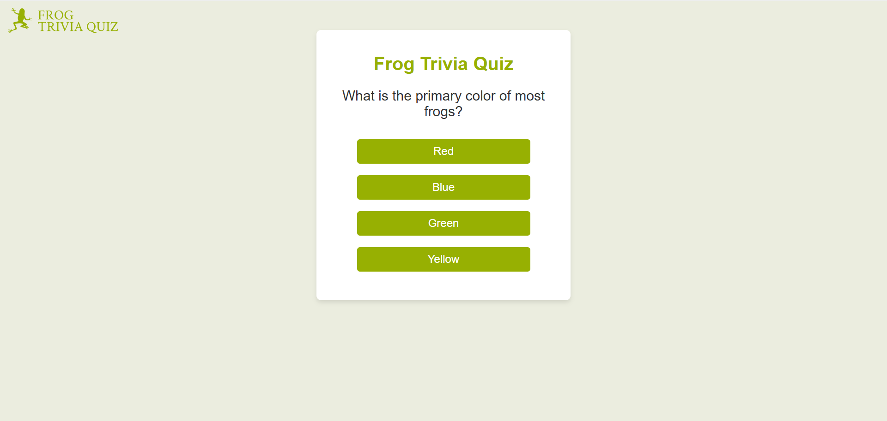
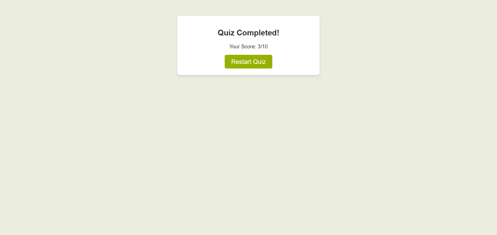

# Frog Trivia Quiz

This is a personal project inspired by JavaScript quiz applications. It's a interactive Frog Trivia Quiz that tests users' knowledge about frogs.

## Table of contents

- [Overview](#overview)
  - [The challenge](#the-challenge)
  - [Screenshot](#screenshot)
  - [Links](#links)
- [My process](#my-process)
  - [Built with](#built-with)
  - [What I learned](#what-i-learned)
- [Author](#author)

## Overview

### The challenge

Users should be able to:

- Answer trivia questions about frogs with multiple-choice options.
- Receive instant feedback on their answers (correct or incorrect).
- View their total score at the end of the quiz.
- Restart the quiz after completing it.

### Screenshot

  
Quiz Interface

  

  
End Screen

  

### Links

- [Solution URL:](https://github.com/Lasse-Rodal/Frog-trivia-quiz)
- [Live Site URL:](https://lasse-rodal.github.io/Frog-trivia-quiz/)

## My process

### Built with

- Semantic HTML5 markup
- CSS custom properties
- JavaScript
- DOM manipulation
- Event listeners
- Mobile-first workflow

### What I learned

In this project, I practiced JavaScript. Mainly:
- Handling user input with event listeners.
- Restarting the quiz by reloading the application state.

## Author

- Github - [Lasse Rodal Pedersen](https://github.com/Lasse-Rodal)
